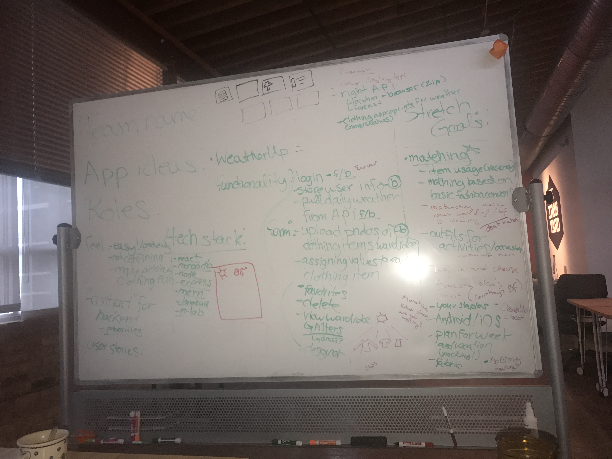
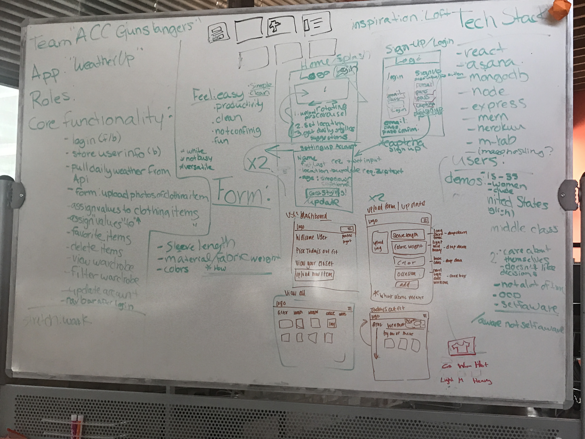
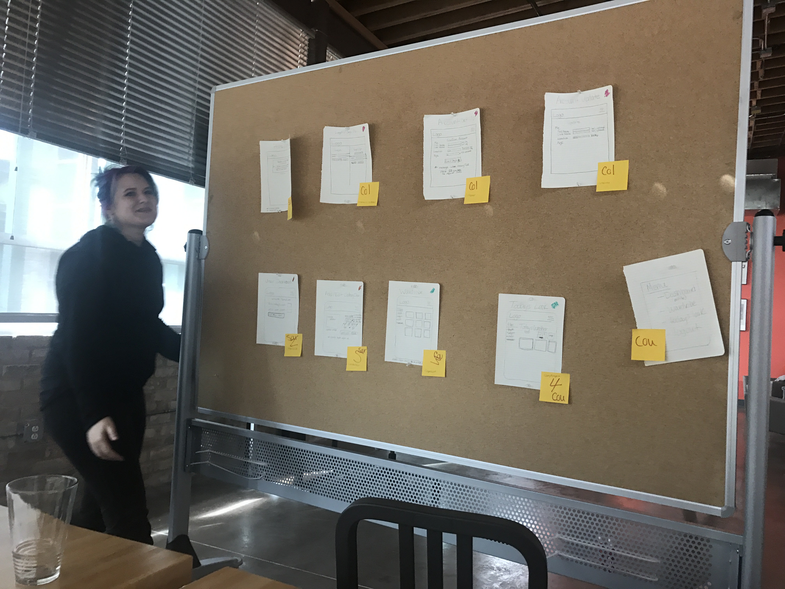
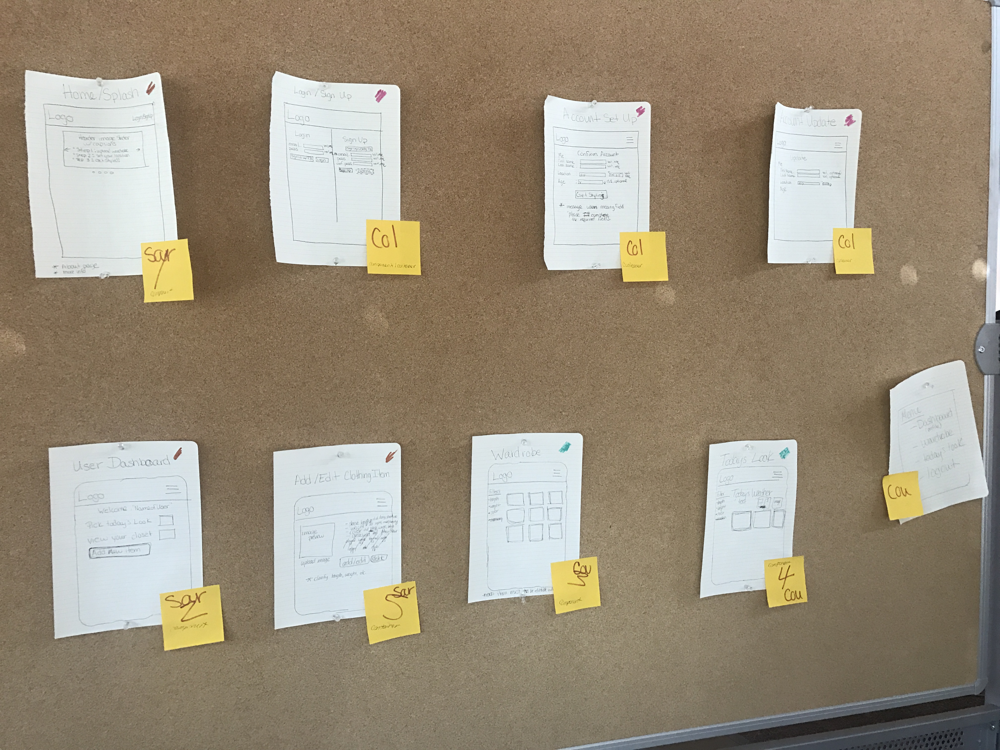
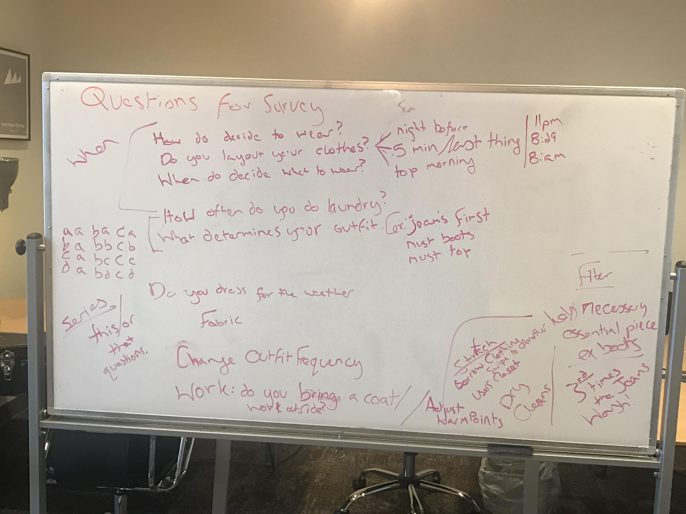

<b>WORK IN PROGRESS</b>
 
Live Link: <a href=""> Tunic.com</a>

<b>BACK END DATA BASE</b>
 
Being Created using Spring,

<b>DESIGN</b>

<b>Colors:</b> 
<b>peach:</b> #FF8D82 
<b>purple: </b>#60507B 
<b>beige:</b> #FBFAEA 
<b>Logo </b> (working logo; improve when spare time available):
 

<b>APIs:</b>

<b>Weather API:</b> https://home.openweathermap.org/

<b>Back End gitHublink:</b>  https://github.com/FlanaganReidy/wardrobeAPI

 
<b>Process</b>
 
Initial Brain Storm
We began with the question, "What if a weather app could help you decide what to wear?" (it was the first sign of fall in Austin, Texas an a frigid 75) From there we realized all the problems that a wardrobe management file could solve.
 

 
<b>Focus On MVP</b>
 
We had some great ideas. Time was a barrier, as is often the case, and we had to produce a working app. Balancing what our favorite features and what we knew we could do, we set a task list.
 

 
<b>Not Assuming the Customers Wants</b>
 
We had some great ideas, but they were our ideas, 3 people that lived pretty similar lifestyles. We needed to know what other people thought and how they behaved. Our process was walking through interacting with a wardrobe and we would ask questions along the way. Then we repeated the process over and over again. We picked the questions that would yield what types of filters we might create, made a surveymonkey and sent it everywhere. Of course a couple more stretch goals were added.
 

npm install boron
