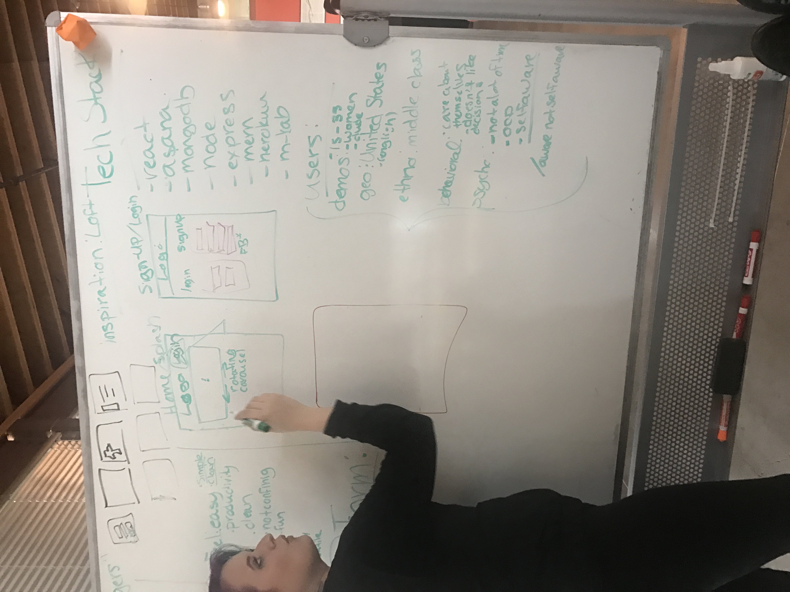

<b>WORK IN PROGRESS</b>
 
Live Link: <a href=""> Tunic.com</a>

<b>BACK END DATA BASE</b>
 
Being Created using Spring,

<b>DESIGN</b>

<b>Colors:</b> 
<b>peach:</b> #FF8D82 
<b>purple: </b>#60507B 
<b>beige:</b> #FBFAEA 
<b>Logo </b> (working logo; improve when spare time available):
 

<b>APIs:</b>

<b>Weather API:</b> https://home.openweathermap.org/

<b>Back End gitHublink:</b>  https://github.com/FlanaganReidy/wardrobeAPI

 
Story Boards of My Pages
 
BLANK PAGE

 
BLANK PAGE
 

 
BLANK PAGE
 

 
BLANK PAGE
 

 
BLANK PAGE
 

 
BLANK PAGE
 

 
BLANK PAGE
 

 
BLANK PAGE
 

 
BLANK PAGE
 

 
BLANK PAGE
 

 
BLANK PAGE
 

